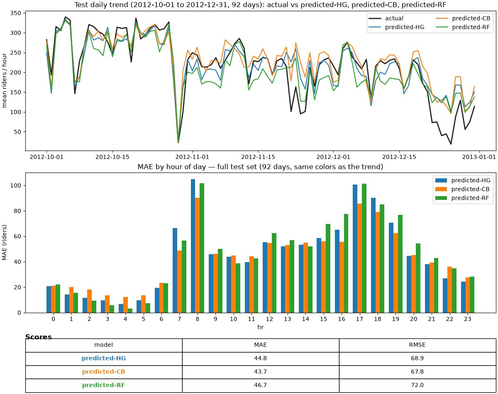

# MLLearn — hourly bike-share demand

Kedro pipeline that predicts **how many riders use the system in a given hour** (`total_users`), using calendar and weather only. Built as a learning project that follows the same steps an analyst would take: define the target, block leakage, split in time, beat a naive baseline, then show **where** the model is still wrong.

**Data:** [UCI Bike Sharing (hourly)](https://archive.ics.uci.edu/dataset/275/bike+sharing+dataset). Prediction CSVs under `data/` are not in git; reporting plots and scores in `data/08_reporting/` are.

A naive forecast that always uses the **train-period mean** (~185 riders) misses the test set by about **157 MAE**. On the same time split, three no-lag models (calendar + weather only) land around **44–47 MAE**. **CatBoost is slightly best** (43.7 MAE / 67.8 RMSE) vs HistGradient (44.8 / 68.9) and random forest (46.7 / 72.0), on hours from **1 Oct 2012 through 31 Dec 2012** (92 days).

That is useful for staffing in the average hour. The plot below still shows **commute peaks** (roughly 8 and 17–18) as the expensive misses, and a late-December drop the models over-predict.

## Insights

Same test window for all three learners: daily mean of hourly riders (top), MAE by hour of day (middle), scores (bottom).

[Open comparison.png](data/08_reporting/comparison.png)



## Process 

- **Target** is `cnt` renamed to `total_users`. `casual_users` + `registered_users` *are* the target, so those columns never go into `X`. Row id `instant` is dropped too.
- **Data was sorted by time and Split is by time**, not a shuffled sklearn split. Train = rows before `2012-10-01`; test = the rest (~15.2k / 2.2k hours).
- **No lag features in this baseline** on purpose. The model can only use information available in that hour’s calendar and weather. Lags (24h / 168h) are a next experiment, not hidden in this run.

## Pipeline (Kedro)

`uv run kedro run` (or `uv run kedro run --pipeline=training`):

| Step | What it does |
|---|---|
| Rename | Map raw UCI names to readable columns |
| Prepare | Parse `datetime`, sort, drop leakage/id |
| Time split | Cutoff from `conf/base/parameters.yml` |
| Predict | Fit HistGradient, CatBoost, and random forest (`random_state=42`) |
| Score | MAE / RMSE per model → `data/08_reporting/*_metrics.json` |
| Compare | Overlay + scores → [`data/08_reporting/comparison.png`](data/08_reporting/comparison.png) |

Code lives in `src/mllearn/pipelines/`. Settings: `conf/base/parameters.yml`, `conf/base/catalog.yml`. The same logic is walked through in `notebooks/modelling.ipynb`.

## Reproduce locally

Python 3.12. This repo uses **uv** (Kedro is not assumed to be on your PATH).

```bash
uv sync
# Place the hourly CSV at data/01_raw/bike_sharing_hour_data.csv
uv run kedro run
```

Do not commit CSVs, credentials, or `conf/local/`.

## Next (intentional backlog)

- Lag 24 and 168 on `total_users`
- Mean-by-hour dummy as a stronger naive baseline
- Persist the fitted model as a pickle for a later inference path

See `notes/later-optional.md`.
